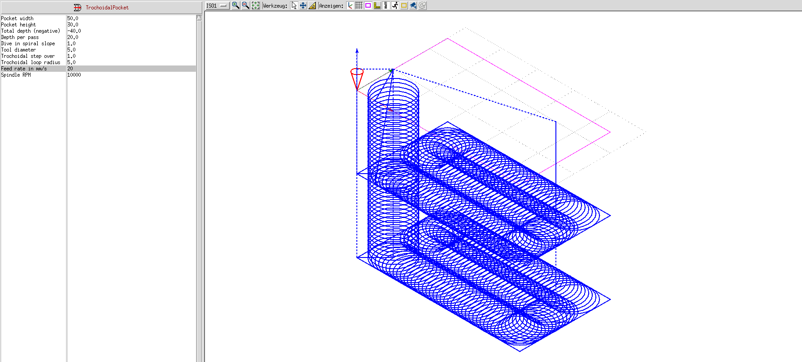

# Trochoidal pocket plugin for bCNC

Plugin to quickly create pocket routes via trochoidal paths.

Endresult:

## Installation

Find your bCNC installation folder (if installed with pip on linux this is eg `~/.local/lib/python3.11/site-packages/bCNC`)

Copy the `trochoidalPocket.py` to `~/.local/lib/python3.11/site-packages/bCNC/plugins/trochoidalPocket.py`

